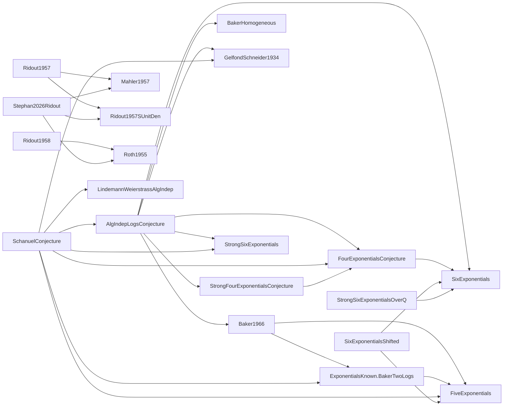

# Fact graph

Generated by `scripts/fact-graph` from the built Lean environment (statements as the kernel
sees them).  Do not edit by hand.  🔮 open conjecture · 📚 cited theorem · ❌ refuted in the kernel.

## Implications between named hypotheses

A theorem with several hypotheses draws one arrow from each (they are needed *jointly*).

| Hypothesis | Status | Theorems resting on it |
|---|---|---|
| `SchanuelConjecture` | 🔮 conjecture | 50 |
| `BakerHarmanPintz2001` | 📚 theorem | 17 |
| `AlgIndepLogsConjecture` | 🔮 conjecture | 13 |
| `Matomaki2007` | 📚 theorem | 13 |
| `LindemannWeierstrassAlgIndep` | 📚 theorem | 11 |
| `Dubickas2022PisotGap` | 📚 theorem | 8 |
| `Schoenfeld1976` | 📚 theorem | 8 |
| `RiemannHypothesis` | 🔮 conjecture | 8 |
| `Dubickas2022` | 📚 theorem | 7 |
| `Stephan2026Ridout` | 📚 theorem | 6 |
| `Nesterenko1996` | 📚 theorem | 6 |
| `FourExponentialsConjecture` | 🔮 conjecture | 5 |
| `Ridout1957` | 📚 theorem | 4 |
| `SixExponentialsShifted` | 📚 theorem | 4 |
| `SixExponentials` | 📚 theorem | 4 |
| `BakerHomogeneous` | 📚 theorem | 3 |
| `Baker1966` | 📚 theorem | 2 |
| `GelfondSchneider1934` | 📚 theorem | 2 |
| `FiveExponentials` | 📚 theorem | 2 |
| `Dudek2016` | 📚 theorem | 2 |
| `Ridout1958` | 📚 theorem | 1 |
| `ExponentialsKnown.BakerTwoLogs` | 📚 theorem | 1 |
| `StrongSixExponentialsOverQ` | ❌ refuted | 1 |
| `StrongFourExponentialsConjecture` | 🔮 conjecture | 1 |
| `Roth1955` | 📚 theorem | 1 |
| `Mahler1957` | 📚 theorem | 1 |

Unconditional theorems in the scanned namespaces (no named hypothesis): 315.

## Refuted

- `StrongSixExponentialsOverQ`
